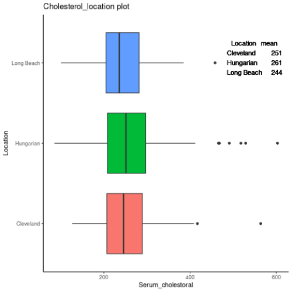
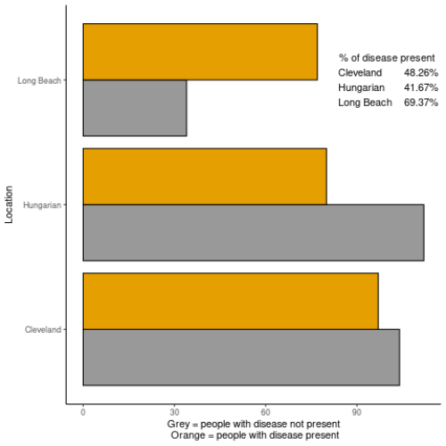
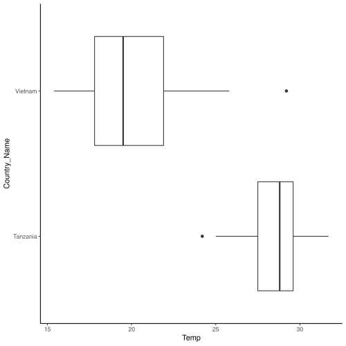

presentation
========================================================
author: 
date: 
autosize: true

First Slide
========================================================

For more details on authoring R presentations please visit <https://support.rstudio.com/hc/en-us/articles/200486468>.

- Bullet 1
- Bullet 2
- Bullet 3

Slide With plot
========================================================

Slide With another plot
========================================================

Slide With another plot
========================================================

I am very special, not just summary 1\

\
I am another plot du du du du du du
